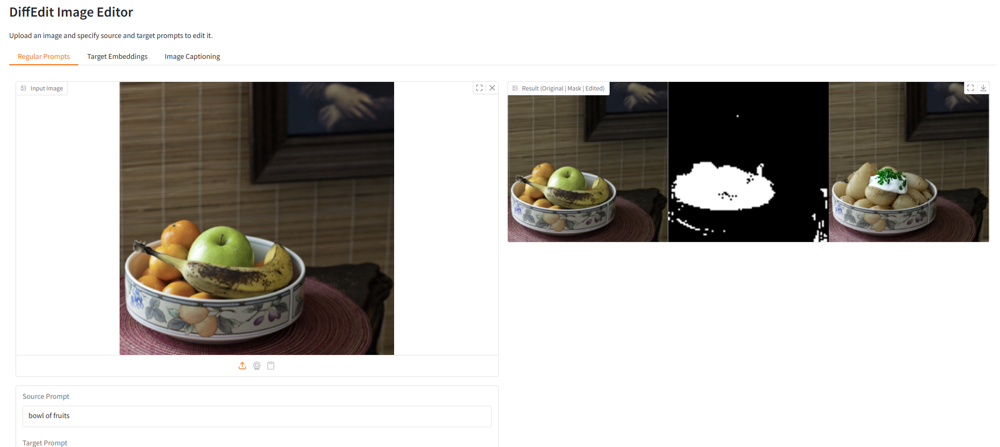

# DiffEdit Image Editor



A Gradio web application that implements the DiffEdit pipeline for image editing using Stable Diffusion. The application allows users to edit images by specifying source and target prompts, which will generate a mask and apply the changes accordingly.

## Features

- **Regular Prompts**: Edit images using direct text prompts
- **Target Embeddings**: Use T5-generated prompts and embeddings for more nuanced edits
- **Image Captioning**: Automatically generate captions for images using BLIP model

## Setup

1. Create a virtual environment (recommended):
```bash
python -m venv venv
source venv/bin/activate  # On Windows: venv\Scripts\activate
```

2. Install PyTorch CPU version:
```bash
pip install torch torchvision torchaudio --index-url https://download.pytorch.org/whl/cpu
```

3. Install the required dependencies:
```bash
pip install -r requirements.txt
```

## Usage

1. Run the application:
```bash
python app.py
```

2. Open your web browser and navigate to the URL shown in the terminal (usually http://127.0.0.1:7860)

3. Using the application:

   ### Regular Prompts Tab
   - Upload an image using the "Input Image" upload button
   - Enter the source prompt describing what's currently in the image
   - Enter the target prompt describing what you want to change it to
   - Click "Process Image" to generate the result
   - The output will show three images side by side:
     - Original image
     - Generated mask
     - Edited image

   ### Target Embeddings Tab
   - Upload an image
   - Enter simple concepts (e.g., "bowl" and "basket")
   - Click "Process Image with Embeddings"
   - The T5 model will generate multiple prompts and create embeddings for more nuanced edits

   ### Image Captioning Tab
   - Upload an image
   - Click "Generate Caption"
   - The BLIP model will analyze the image and generate a natural language description

## Example

- Source prompt: "a bowl of fruits"
- Target prompt: "a basket of pears"

## Requirements

- Python 3.8 or higher
- CPU (no GPU required)
- See requirements.txt for Python package dependencies

## License

This project is licensed under the MIT License - see the LICENSE file for details. 